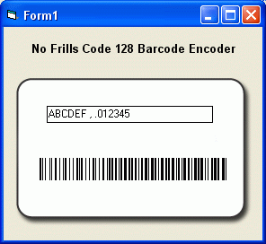



## Easiest ever Barcode Encoder

### Description

This encoder actually works (ie produces a valid barcode that will return the inputted text when scanned), and it's really really (REALLY) short & simple!

It uses the Code 128 symbology so can accept any alpha-numeric characters as well as some special characters.

All feedback and comments are welcome and your votes are appreciated if you find the code useful.
 
### More Info
 

             |
---                |---
**Submitted On**   |2003-10-14 11:34:18
**By**             |[Steve W](https://github.com/Planet-Source-Code/PSCIndex/blob/master/ByAuthor/steve-w.md)
**Level**          |Intermediate
**User Rating**    |4.9 (74 globes from 15 users)
**Compatibility**  |VB 6\.0
**Category**       |[Graphics](https://github.com/Planet-Source-Code/PSCIndex/blob/master/ByCategory/graphics__1-46.md)
**World**          |[Visual Basic](https://github.com/Planet-Source-Code/PSCIndex/blob/master/ByWorld/visual-basic.md)
**Archive File**   |[Easiest\_ev1678971222003\.zip](https://github.com/Planet-Source-Code/steve-w-easiest-ever-barcode-encoder__1-50256/archive/master.zip)

